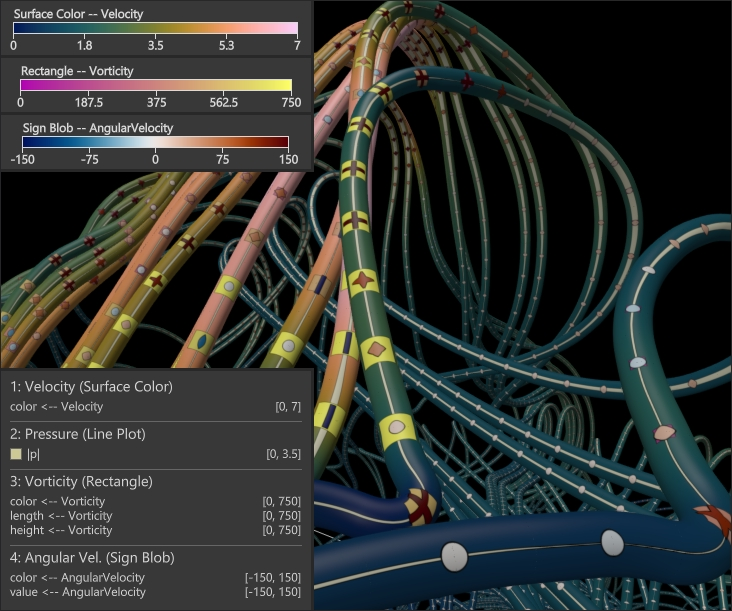

# OnTubeVis
This visualization tool enables rendering of line data sets using high-quality spline tube geometry with surface texture mapping of attributes. It was created for the paper *"On-Tube Attribute Visualization for Multivariate Trajectory Data"* (https://doi.org/10.1109/TVCG.2022.3209400).

> ### Disclaimer
> The application was tested on systems equipped with relatively modern discrete graphics hardware (Nvidia GTX 680 and RTX 2080/Ti). The application was not tested on AMD graphics cards. Running the application on notebooks using only integrated graphics may not work as intended.



## Build Instructions

### Using the Integrated Build System (Windows only)

Currently, the OnTubeVis prototype works best on Windows. A Visual Studio project for building can be generated via the dedicated build system of the [CGV Framework](https://github.com/sgumhold/cgv/tree/develop).

Once this is set up, a Visual Studio solution for building the OnTubeVis plugin, viewer application and all required libraries can be generated by invoking the OnTubeVis.pj file. The CGV Framework is self-contained and no other dependencies except OpenGL (and optionally, CUDA/OptiX) are needed.

### Using CMake

It is possible to build the OnTubeVis prototype on Linux or Windows using CMake, for which no dependencies other than the native GUI development packages of the target platform and OpenGL (plus optionally, CUDA/OptiX) need to be present. The CGV Framework will be fetched automatically if not present on the system and be integrated into the build.

To compile the prototype into a working state, build either the `OnTubeVis` or `OnTubeVis_exe` targets. The latter will create a single executable that has all dependencies (except CUDA/OptiX if enabled) linked in statically and is ideal for re-distribution, while the former builds OnTubeVis as a dynamic plugin for the viewer application of the CGV Framework (and can be invoked using the launch script that will be generated in the root of your build folder).

> **NOTE**: Due to GCC bug [#85282](https://gcc.gnu.org/bugzilla/show_bug.cgi?id=85282) OnTubeVis can currently not be built using GCC! For building on *nix systems, using Clang is recommended.

### Dependencies

The only required dependency is the CGV Framework, which in turn only requires basic native development packages of the target OS. On Windows, having a working installation of Visual Studio and a recent NVIDIA graphics driver is sufficient, no additional packages/SDKs/libraries need to be installed for a non-OptiX-enabled build.

On Ubuntu (and likely most other Debian-based Linux distros), the required native packages are
```
libglx-dev libglew-dev libxi-dev libxinerama-dev
```

## Short Usage Instructions

Load data sets and on-tube layer configurations by drag & drop or through the GUI. Configurations depend on attributes and therefore only work for their respective data set.

### View Interaction

- Use the mouse pointer to rotate the view.

- Hold the right mouse button to pan the view.

- Hold shift to tilt the view.

- Click on any geometry to set the view focus.

- Scroll to zoom in. When scrolling while the pointer is over some geometry, the view will zoom in to that position.

### Keyboard Shortcuts:

Reset to far view: `,`

Reset to near view: `.`

Toggle ambient occlusion: `A`

Cycle grid modes: `G`

Toggle color maps widget: `M`

Toggle bounding box: `O`

Double tube radius: `R`

Half tube radius: `Shift + R`

Toggle wireframe bounding box: `W`

Toggle background colors: `F12`

### Color Scales

To add a color map, open the "Color Scales" GUI group. Enter a name that is not already taken and press `Add Color Map`. The color scale will appear at the bottom of the list. Press the pencil icon rigt next to the name to open the editor. Color scale presets cannot be edited. To add control points, hold `Ctrl` and click with the mouse. Hold `Alt` and click on a control grip to delete it. Change colors in the GUI.

## Known Problems

Z-fighting might produce pixel artifacts at segment boundaries when using the rasterization render path. These stem from the limitations of the iterative root solver used for the intersection routine, as the amount of iterations directly determines the precision of the computed intersection and therefore also the computed depth values. To mitigate this somewhat, the spherical segment caps are hidden starting from a certain view distance which can be set with the `Cap Clip Distance` (in scene units) located in the `Tube Style` GUI node.

The effect is further influenced by the overall scene extents and near and far clipping plane. For data sets with a large scene extents it might be necessary to increase the `Cap Clip Distance` to high values like 100 or 1000. The clipping planes can be configured in the `Stereo Interactor` GUI tab by changing `z Near` and `z Far`.
